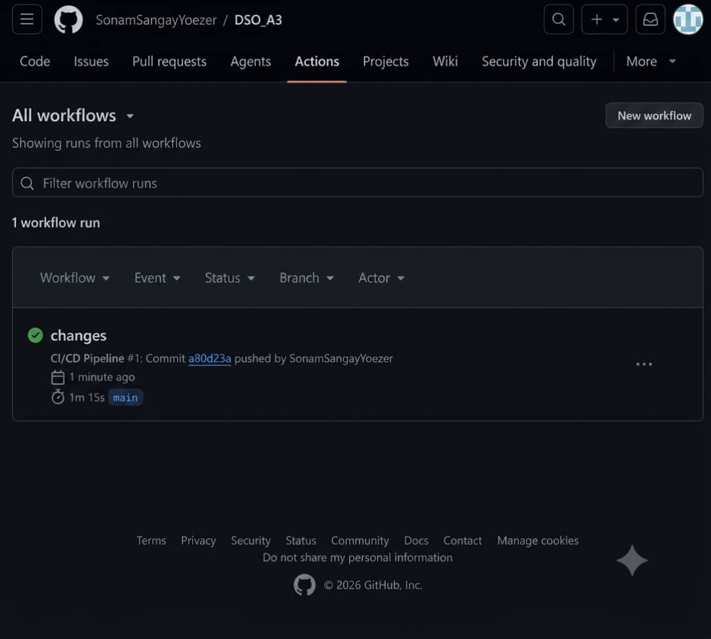

# SonamSangayYoezer_2240366_DSO101_A3

# Assignment 3 Report
## Continuous Integration and Continuous Deployment (CI/CD) Pipeline for Node.js To-Do Application

---

## Student Information

| Field | Details |
|--------|---------|
| **Student Name** | YOUR NAME |
| **Student ID** | YOUR ID |
| **Course** | YOUR COURSE |
| **Unit** | YOUR UNIT |
| **Assignment** | Assignment 3 |
| **Submission Date** | YOUR DATE |

---

# Aim

The aim of this assignment is to implement a complete **Continuous Integration and Continuous Deployment (CI/CD)** pipeline using **GitHub Actions, Docker, DockerHub, and Render.com** for a Node.js To-Do application.

The pipeline automates the process of building, testing, containerizing, and deploying the application whenever changes are pushed to the GitHub repository.

---

# Theory

Continuous Integration (CI) and Continuous Deployment (CD) are software development practices that automate code integration, application testing, and software deployment. These practices help developers deliver software faster while improving reliability and reducing deployment errors.

### GitHub

GitHub is a web-based platform used for version control and source code management. It enables developers to store repositories and collaborate efficiently on software projects.

### GitHub Actions

GitHub Actions is GitHub's built-in automation service that allows developers to create workflows triggered by events such as code pushes, pull requests, or scheduled tasks. It is widely used for implementing CI/CD pipelines.

### Docker

Docker is a containerization platform that packages an application together with all required dependencies into a portable container. Containers ensure applications run consistently across different environments.

### DockerHub

DockerHub is a cloud-based container registry used to store, share, and distribute Docker images.

### Render.com

Render.com is a cloud hosting platform that automatically deploys web applications and Docker containers. It can pull Docker images directly from DockerHub for deployment.

### GitHub Secrets

GitHub Secrets securely store sensitive information such as API keys, DockerHub credentials, and deployment tokens. These secrets are safely accessed within GitHub Actions workflows without exposing confidential information.

In this assignment, GitHub Actions automatically builds a Docker image, pushes it to DockerHub, and triggers deployment on Render.com whenever code is pushed to the **main** branch.

---

# Project Architecture



---

# Implementation Steps

## Task 1 – GitHub Repository Verification

The following verification steps were completed:

- Verified the Node.js To-Do application repository on GitHub.
- Ensured the repository visibility was set to **Public**.
- Reviewed the `package.json` file to confirm that the required scripts were available.

### package.json Scripts

```json
{
  "scripts": {
    "start": "node server.js",
    "test": "jest"
  }
}
```

These scripts allow the application to start successfully and execute automated tests.

---

## Task 2 – Docker Containerization

A **Dockerfile** was created to containerize the Node.js application.

### Dockerfile

```dockerfile
FROM node:20-alpine

WORKDIR /app

COPY package*.json ./

RUN npm install

COPY . .

RUN npm test

EXPOSE 3000

CMD ["npm", "start"]
```

### Dockerfile Explanation

| Instruction | Description |
|-------------|-------------|
| `FROM node:20-alpine` | Uses the lightweight Node.js LTS image |
| `WORKDIR /app` | Sets the application working directory |
| `COPY package*.json ./` | Copies dependency files |
| `RUN npm install` | Installs project dependencies |
| `COPY . .` | Copies application source code |
| `RUN npm test` | Executes automated tests |
| `EXPOSE 3000` | Opens port 3000 |
| `CMD ["npm", "start"]` | Starts the application |

### Local Docker Testing

#### Build Docker Image

```bash
docker build -t todo-app .
```

#### Run Docker Container

```bash
docker run -p 3000:3000 todo-app
```

The application was successfully built and executed inside the Docker container.

---

## Task 3 – GitHub Actions Workflow Configuration

A workflow file named:

```
.github/workflows/deploy.yml
```

was created.

The workflow automatically executes whenever code is pushed to the **main** branch.

### Workflow

```yaml
on:
  push:
    branches: ["main"]

jobs:
  build-and-deploy:
    runs-on: ubuntu-latest

    steps:
      - name: Checkout Repository
        uses: actions/checkout@v4

      - name: Login to DockerHub
        uses: docker/login-action@v3
        with:
          username: ${{ secrets.DOCKERHUB_USERNAME }}
          password: ${{ secrets.DOCKERHUB_TOKEN }}

      - name: Build and Push Docker Image
        run: |
          docker build -t ${{ secrets.DOCKERHUB_USERNAME }}/todo-app:latest .
          docker push ${{ secrets.DOCKERHUB_USERNAME }}/todo-app:latest

      - name: Trigger Render Deployment
        run: |
          curl "$RENDER_DEPLOY_HOOK"
```

### Workflow Stages

1. Checkout Repository
2. Login to DockerHub
3. Build Docker Image
4. Push Docker Image
5. Trigger Render Deployment

---

## Task 4 – Render Deployment

Deployment was completed using the following steps:

1. Logged into Render.com.
2. Created a new Web Service.
3. Selected **Deploy Existing Image**.
4. Connected the DockerHub repository.
5. Configured deployment settings.
6. Successfully deployed the application.

After deployment, Render generated a public URL for accessing the running application.

---

# Challenges Faced

## Docker Build Issues

**Problem**

Dependency installation errors occurred during Docker image creation.

**Solution**

Verified and corrected the `package.json` configuration and project dependencies.

---

## GitHub Actions Workflow Errors

**Problem**

Workflow execution failed because of incorrect secret names.

**Solution**

Verified and updated the GitHub Actions secret names.

---

## DockerHub Authentication Problems

**Problem**

DockerHub login failed because of an invalid access token.

**Solution**

Generated a new DockerHub Access Token and configured it correctly.

---

## Render Deployment Issues

**Problem**

Render did not automatically redeploy after new Docker images were pushed.

**Solution**

Configured a deployment webhook within GitHub Actions to trigger automatic redeployment.

---

# Learning Outcomes

Through this assignment, the following concepts were learned:

- Understanding CI/CD pipelines
- Using GitHub Actions for workflow automation
- Creating Docker containers
- Managing Docker images with DockerHub
- Deploying applications using Render.com
- Using GitHub Secrets for secure credential management
- Automating software deployment processes

---

# Result

The Node.js To-Do application was successfully containerized, automatically built, tested, pushed to DockerHub, and deployed to Render using a complete CI/CD pipeline.

---

# Conclusion

This assignment successfully implemented a complete CI/CD pipeline using GitHub Actions, Docker, DockerHub, and Render.com.

The pipeline automatically builds, tests, containerizes, and deploys the Node.js To-Do application whenever new code is pushed to GitHub.

GitHub Actions eliminated manual deployment tasks, Docker ensured a consistent runtime environment, DockerHub managed container images, and Render.com hosted the deployed application.

Overall, this assignment provided practical experience with modern DevOps tools and demonstrated how automation improves software delivery, reliability, and efficiency.

---

# References

1. GitHub. (2026). *GitHub Actions Documentation*. https://docs.github.com/en/actions
2. Docker Inc. (2026). *Docker Documentation*. https://docs.docker.com/
3. Docker Inc. (2026). *Docker Hub Documentation*. https://docs.docker.com/docker-hub/
4. Render. (2026). *Render Documentation*. https://render.com/docs
5. Node.js. (2026). *Node.js Documentation*. https://nodejs.org/docs
6. GitHub. (2026). *Managing Encrypted Secrets for GitHub Actions*. https://docs.github.com/en/actions/security-guides/encrypted-secrets